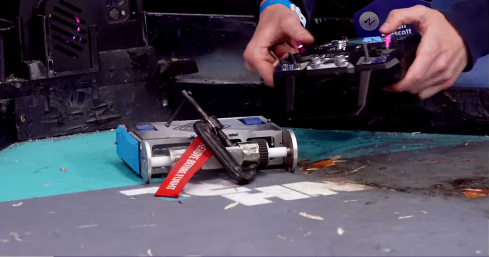

# FREEDOM
**3lb Vertical Spinner Combat Robot**
 
**Villanova Combat Robotics | National Havoc Robotics League (NHRL)**
 
**Role: Weapon Systems Design Lead**

<!-- HERO IMAGE: final photo of the bot, or CAD render if photo isn't available -->

## Overview

Freedom is a 3lb vertical spinner combat robot built for the National Havoc Robotics League (NHRL), one of the largest competitive combat robotics circuits in the country. Freedom was part of the first cohort of robots Villanova Combat Robotics ever brought to competition, the club's first appearance at NHRL.

As Weapon Systems Design Lead, I owned the full weapon system: CAD design and iteration in SolidWorks, machining the components on a lathe and mill, and integrating the electronics (soldering, motor controller tuning, and receiver configuration) needed to get the system running reliably in competition.
## Bill of Materials
| Component | Function | Part | Photo |
|---|---|---|---|
| Weapon Motor | Drives the weapon system | BadAss 2315-1480Kv Brushless Motor |  |
| Drive Motor | Powers wheel drivetrain | Max Brushless 2006 Mk2 – Beetleweight Planetary Gearmotor |  |
| Weapon ESC | Controls weapon motor speed | Vortex 80A ESC (Beetle Weapon / Big Bot Drive) |  |
| Weapon Metal | Raw stock for weapon fabrication | 2" Alloy Steel Round Bar, 4140 Annealed, Cold Finish |  |
| Dead Shaft Metal | Raw stock for dead shaft fabrication | 1/2" Alloy Steel Round Bar, 4140 Annealed, Cold Finish |  |
| Ball Bearings | Support rotating shafts | TRITAN Radial Ball Bearing 6000, Dbl Sealed, 10 mm Bore, 26 mm OD, 8 mm Wd |  |
| Timing Belt Pulley | Transfers rotational drive to belt | High-Strength GT Timing Belt Pulley, Press-Fit, 9 mm Max Belt Width, 3/16" Shaft, 16T |  |
| Timing Belt | Transmits drive motor power | High-Strength Ultra-Quiet Timing Belt, Curved Teeth, 9 mm, 165-3P-09, Gates PowerGrip GT |  |
| Wheels | Provide traction/mobility | BaneBots Wheel, 2" x 0.8", Hub Mount, 50A, Blue |  |
| Wheel Hubs | Mount wheels to drive shaft | T81 Hub, 6 mm Shaft |  |

## Design & CAD

<!-- CHASSIS CAD -->
 
<!-- WEAPON CAD -->
<!--  -->

*Chassis CAD and weapon system CAD assembly with all sub components modeled in SolidWorks.*

The weapon system went through multiple design iterations in SolidWorks before being finalized for machining. As Weapon Systems Design Lead, this design work, and the machining that followed, was my primary responsibility on the team.

## Fabrication

<!-- PLA PROTOTYPE -->
 

*PLA prototype of the weapon system, used to validate fit and geometry before machining the final components.*

Once the design was validated in PLA, the final weapon system components were machined on a lathe and mill to produce a functional, competition-ready system.

## Electronics

Electrical integration included soldering, tuning motor controllers, and configuring the receiver for reliable operation under competition conditions.

## Testing & Demo

<!-- DRIVING DEMO VIDEO -->
<video src="https://github.com/user-attachments/assets/a1d59dde-191d-4497-a97f-fc3ec471614c" controls width="200"></video>
*Demo: FREEDOM driving under remote control.*

## Status

Freedom competed at NHRL as part of Villanova Combat Robotics' first-ever competition cohort. The weapon system, from CAD through machining and electrical integration, was designed, built, and fielded as a complete, competition-ready system.

## Future Work

- **Weapon system iteration** based on lessons learned from competition performance
